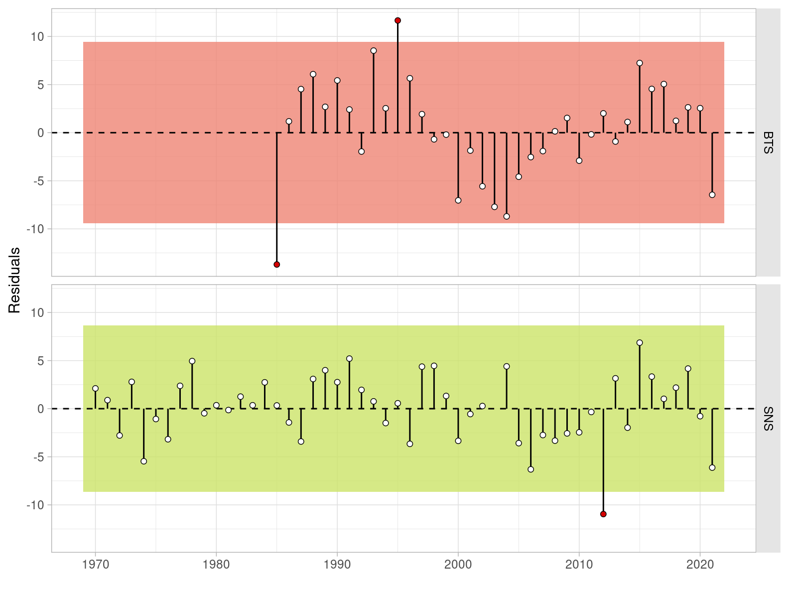

---
output:
  officedown::rdocx_document:
    reference_num: true
    number_sections: false
    reference_docx: !expr system.file('rmarkdown', 'templates', 'stockReport', 'resources', 'reportTemplate.docx', package='icesdown')
tags: [ICES SOL.27.4 WGNSSK 2021]
bibliography: references.bib
---

```{r, knitr, echo=FALSE, message=FALSE, warning=FALSE}
library(knitr)
opts_chunk$set(echo=FALSE, message=FALSE, warning=FALSE,
  fig.width=6, fig.height=5, out.width="90%", fig.pos='!hbt')
library(officedown)
library(officer)
library(flextable)
```

```{r pkgs}
library(FLCore)
library(icesAdvice)
```

```{r data}
load("output/model.Rdata", verbose=FALSE)
load("output/tables.Rdata", verbose=FALSE)

npy <- 2020    # previous
py <- ac(npy)
dy <- ac(npy + 1) # data
iy <- ac(npy + 1) # intermediate
fy <- ac(npy + 3) # forecast
sy <- ac(npy + 4) # ssb
```

# Sole (Solea solea) in Subarea 27.4 (North Sea)

## General

The assessment of sole in Subarea 27.4 is an update of last year's model run. This is the result of applying the methodology agreed at the last benchmark, carried out in February 2020 (ICES WKFLATNSCS, 2020). The adopted assessment model is the AAP statistical catch-at-age model of Aarts & Poos (2009), already applied in the past. The model uses two indices of abundance: the Sole Net Survey (SNS), covering the coastal areas of the Southern North Sea, and a combined index based on the BTS Q3 survey, including data from The Netherlands, Belgium and Germany. This index covers the full area of distribution of the stock. Further details about the implementation of the BTS survey and changes to the stock assessment model can be found in the benchmark report (ICES WKFLATNSCS, 2020).

The benchmark agreed on the settings to be applied to the AAP model for the assessment of sol.27.4 and for the forecasts providing annual advice on catch limits. North sea sole has been defined as a category 1 stock according to ICES guidelines, and the advice presented in this section refers to catch limits for `r fy`.

### Stock structure and definition

North sea sole is assumed to consist of a single stock unit.

### Ecosystem aspects

North sea sole is commonly distributed along the Southern half of the North Sea. Spawning takes place in shallow waters on the Southern coasts of the North Sea. Episodic large recruitment events take place at irregular intervals, the most recent being the strong 2018 year class.

### Fisheries

Many vessels in the beam trawl fleet, targeting sole in the North Sea, transitioned in the past decade to using electrical pulse gears. In 2011, approximately 30 derogation licenses for pulse trawls were taken into operation, a number than then increased to 42 in 2012.

The catch composition of these gears has been found to be different from the traditional beam trawl (ICES, 2018). The impact of this gear transition on the North Sea ecosystem has been evaluated by ICES (ICES, 2018). ICES recommended that further studies aimed at investigating catch composition of these innovative gears in comparison to traditional beam trawls were undertaken.

Between 2014 and 2017 the use of pulse trawls in the main fishery operating in the North Sea increased and less vessels were operating with traditional beam trawls. The pulse gear allows fishing of softer grounds and as a result the spatial distribution of the main fisheries has changed to the southern part of Division 4.c. As a consequence a larger proportion of the sole catch is now taken in this area (ICES, 2018).

In 2019 the European Parliament decided to ban pulse fisheries in European waters. This ban on pulse fishing implies that ultimately only 5% of the fleet of each member state can continue its fishing activities with the pulse trawl until 1 July 2021, after which a total ban will apply. In this context, research into the effects of the pulse trawl on commercial stocks and wider ecosystem effects has still continued. The precise response to the fleet to the ban is still to be observed, but it appears it is not simply a return to the gear configurations in use before the advent of pulse.

BMS landings of sole reported to ICES are currently much lower than the estimates of catch below the minimum conservation reference size (MCRS), 9.2% of the total catch from observer programs.

### Management regulations

ICES is requested to provide advice based on the MSY approach. ICES advises that when the MSY approach is applied, total catch in `r fy` should equal that corresponding to the level expected to impose a fishing mortality equal to $F_{MSY}$, 15 330 tonnes.

## Fisheries data

### Official catches

For `r dy`, the official landings are presented next to the landings and discards data submitted to Intercatch in Figure \@ref(fig:official). A time-series of the official landings by country and overall total, the officially reported BMS landings, the landings reported to ICES and the agreed TAC are presented in Table \@ref(tab:tac).

### Intercatch processing

Data submitted on landings and discards at age by métier and quarter has been extracted from Intercatch. Figures \@ref(fig:iclawt), \@ref(fig:iclape) and \@ref(fig:icdiwt) show the coverage of the landings, as tonnage and as a cumulative percentage, and discards information, respectively, as available in Intercatch. The allocation of discards and age samples to unsampled strata has followed, in overall terms, the following grouping strategy:

- *TBB_DEF* and *OTB_DEF* < 100, separately and by quarter if possible.
- *TBB_DEF* and *OTB_DEF* > 100, separately and by quarter if possible.
- *TBB_CRU* and *OTB_CRU* < 100.
- *TBB_CRU* and *OTB_CRU* > 100.
- *GTR_DEF* and *GNS_DEF*.
- *FPO*, *LLS*, and *MIS*.


### ICES estimates of landings and discards

```{r}
x <- tables$catches[Year %in% c(py, dy), ICES]
dat <- round((x[2] - x[1]) / x[2] * 100, 0)
```

Figure \@ref(fig:catches) presents the time series of total catches, landings and discards over the 1957-`r dy` period. Landings, in numbers by age, as used as input for the assessment, are presented in Table \@ref(tab:tlandingsn) and Figure \@ref(fig:landingsn).  Total landings reported to ICES for sole in Subarea 27.4 in `r dy` amounted to `r round(tables$catches[Year == dy, ICES], 0)` tonnes, a change of around `r dat`% compared to the values reported for `r py`.

Since 2016, small mesh beam trawlers (BT2) with discard rates of around 10%, are required to report BMS landings in Subarea 27.4. The official reported BMS landings in `r dy` were `r round(subset(tables$catches, Year == dy)$BMS, 0)` tonnes. For incorporation in the assessment, BMS landings are merged with the estimated discards.

Discards, in numbers at age, as used as input for the assessment, are presented in Table \@ref(tab:tdiscardsn) and Figure \@ref(fig:discardsn). The proportions of caught fish at age that are discarded Figure over the 2002-`r dy` period, over which data on discards is available, is presented in Figure \@ref(fig:discardsp).

```{r}
dat <- subset(tables$catches, Year==dy)
```

In `r dy`, official catches amounted to `r round((dat$Official/dat$TAC) * 100, 1)`% of the TAC, while landings reported to ICES were `r round(c(landings(run)[,dy])/dat$TAC * 100, 1)`% of the TAC. If both landings and discards estimates are used, total catch in 2020 was `r round((c(catch(run)[,dy])/dat$TAC) * 100, 1)`% of the agreed TAC.

## Weights-at-age

Weights-at-age in the landings of sole in Subarea 27.4 can be found in Table \@ref(tab:tlandingswt) and Figure \@ref(fig:landingswt). These are measured weights from the various national catch and market sampling programs. Discard weights at age (Table \@ref(tab:tdiscardswt)) are derived from the various national catch and discard programs (both observer and self-sampling).

Mean weight-at-age in the discards for the 1957-2002 period, when discards-at-age are reconstructed by the AAP model, are the average over the years 2006 to 2013. Sampling levels were substantially lower before 2006.

Mean weights-at-age in the stock (Table \@ref(tab:tstockwt)) are the average weights from the 2nd quarter landings and discards as constructed by Intercatch. The mean stock weights-at-age have shown a continuous downward trend, returning to values similar to those observed at the start of the time series (Figure \@ref(fig:stockwt)). Mean weights at age for younger ages has also been decreasing in recent years.

## Maturity and natural mortality

A knife-edged maturity-ogive with full maturation at age 3 is assumed for sole in Subarea 27.4 (Table \@ref(tab:tmatm)). No new data was presented at the working group in `r iy`. Natural mortality at age is assumed to be constant at 0.1, except for the year 1963 where a value of 0.9 was used to take into account the effect of the severe winter of 1962-1963. The estimate of 0.9 was based on an analysis of the CPUE in the fisheries targeting sole before and after that period (ICES FWG, 1979).

## Survey data{#cesdata}

Two survey series are used in the assessment of North sea sole:

- Quarter 3 Beam Trawl Survey (BTS), covering the 1985-`r dy` period and containing samples for ages 1 to 10+.
- Quarter 3 Sole Net Survey (SNS), extending from 1970 to `r dy`, with the exception of 2003, and with samples including ages 1 to 6.

An index of abundance is assembled based on the BTS Q3 samples collected by The Netherlands, Belgium and Germany (Figure \@ref(fig:maphauls)), available in the Datras database. An standardized age-based index is calculated using a delta-lognormal GAM model, using the methodology presented in Berg *et al.* (2014). Please refer to the WKFlatNSCS report (ICES, 2020) for further details on the analysis[^1]. This index substitutes the previous one that only utilized samples taken by RV-Isis and, since 2016, by RV-Tridens on the same locations and with the same gear. Ages included in the index are 1 to 10, the last being a plusgroup.

[^1]: Input data, source code and output of the index standardization is available at the <https://github.com/ices-taf/2021_sol.27.4_survey/> TAF repository.

The SNS index is calculated by The Netherlands based on the mean densities across all sampled stations.

A standardized comparison of the two indices over the available time-series is presented on \@ref(fig:btssns), while Figures \@ref(fig:bts) and \@ref(fig:sns) present each individual index in their actual scales. The internal consistency plots of the year class cohorts of the two indices are presented in Figures \@ref(fig:corrbts) and \@ref(fig:corrsns), while the mean standardized indices per cohort and by year are shown on Figures \@ref(fig:btscohort) and \@ref(fig:snscohort). The actual values of the two survey indices used in the assessment are presented in Tables \@ref(tab:tbts) and \@ref(tab:tsns).

A retrospective analysis was carried out for the standardization procedure used to generate the BTS Q3 index of abundances. The same model was applied to a total of 5 1-year *peels*. The resulting indices (Figure \ref{fig:btsretro}), shown here in terms in total biomass) were then used in the stock assessment retrospective analysis.

## Assessment

The model applied to North sea sole is the Aarts and Poos statistical catch-at-age model (AAP; Aarts and Poos, 2009), in use for this stock since the 2015 benchmark (ICES WKNSEA, 2015). AAP models recruitment as an independent yearly factor, informed by the age-1 abundances of both surveys, and uses splines to model yearly patterns of the selectivity and fishing mortality-at-age. Discards-at-age are reconstructed through an estimate of changes in the discard fraction by age and year. The table below gives an overview of data and parameters used in the AAP model, as endorsed by the benchmark (ICES WKFlatNSCS, 2020).

```{r aapconf, tab.cap="Settings of the 2020 AAP stock assessment model for sole in Subarea 27.4.", tab.id="aapconf"}
aapconf <- data.frame(
  Setting = c("Plus group", "First tuning year", "Catchability catches constant for age >=", "Catchability surveys constant for ages >=", "Spline for selectivity-at-age survey, no. knots", "Tensor spline for F-at-age, ages, no. knots", "Tensor spline for F-at-age, years, no. knots"),
  Value = c(10, 1970, 9, 8, 6, 8, 28)
)
autofit(colformat_num(flextable(aapconf), big.mark=""))
```

A summary of the assessment results (recruitment, F and SSB, including confidence bounds) is presented in Figure \@ref(fig:fit). The estimates of spawning biomass and corresponding recruitment at age 1 are shown in Figure \@ref(fig:recssb). The proportion of spawning biomass estimated to be accounted for by age and year is presented in Figure \@ref(fig:propssb). A plot of log-standardized residuals of the model fit to the four data sources employed (the two indices of abundance, landings, and discards at age) is presented in Figure \@ref(fig:residsource). The runs test for both indices [@Carvalho_2021] are presented in Figure \@ref(fig:runstest) for the overall biomass, and Figure \@ref(fig:runstestages) for the numbers at age. Patterns were found to be non-random for ages 2 and 3 on the BTS survey only.

The retrospective patterns for recruitment, spawning biomass and fishing mortality are summarized in Figure \@ref(fig:retro). Figure \@ref(fig:xval) presents the results of an analysis of prediction skills by means of hindcasting cross-validation (carried out following @Carvalho_2021).

Yearly estimates of abundances and fishing mortality-at-age obtained by the model run are presented in Tables \@ref(tab:tstockn) and \@ref(tab:tharvest), respectively.

## Recruitment estimates

The short term forecast for the stock requires an assumption about recruitment in the intermediate year, `r iy`. This has been set to the geometric mean of the 1957-`r py` time series of recruitment estimates, `r format((exp(mean(log(window(rec(run), end=py))))), big.mark=",")` million fish.

## Short-term forecasts

Short-term forecasts were carried out from the abundances estimated by the assessment model in `r dy`, with the following settings

- Natural mortality, maturity and weights-at-age in landings, discards and stock for `r iy`-`r fy` set as the average of the last five years (`r npy-5`-`r npy`).
- Selectivity-at-age for `r iy`-`r fy` set as the average of the last five years (`r npy-5`-`r npy`).
- Ratio of discards to landings at age as the average over the last three years (`r npy-3`-`r npy`).
- Recruitment in `r iy` and `r fy` set as `r format((exp(mean(log(window(rec(run), end=py))))), big.mark=",")` million fish.
- Population numbers in the intermediate year for ages 2 and older are taken from the AAP survivors estimates. 

Fishing mortality in the intermediate year, `r iy`, was set as equaql to that estimated in `r dy`.

Forecasts were carried out using the FLR toolset[^3] [@Kell_2007], and in particular the FLasher package[^4] (Scott and Mosqueira, 2016). Source code for this analysis is available at the corresponding TAF repository[^5]

[^3]: <https://flr-project.org>
[^4]: <https://flr-project.org/FLasher>
[^5]: <https://github.com/ices-taf/2022_sol.27.4_forecast/>

The projections carried out were those necessary to populate the stock catch options table, as summarized here:

- FMSY: Fbar (2021) = `r round(c(refpts$Fmsy), 3)`
- FMSY lower: Fbar (2021) = `r round(c(refpts$lFmsy), 3)`
- FMSY upper: Fbar (2021) = `r round(c(refpts$uFmsy), 3)`
- Zero catch: Fbar (2021) = 0
- Fpa: Fbar (2021) = `r round(c(refpts$Fpa), 3)`
- Flim: Fbar (2021) = `r round(c(refpts$Flim), 3)`
- Bpa: SSB (2022) = `r round(c(refpts$Bpa), 0)`
- Flim: SSB (2022) = `r round(c(refpts$Blim), 0)`
- MSY Btrigger: SSB (2022) = `r round(c(refpts$Btrigger), 0)`
- F2020: Fbar (2021) = 0.256
- Fmp: Fbar (2021) = 0.20
- Roll-over TAC: Catch (2021) = 17 545 t

## Reference points

The reference points for sole in Subarea 4 have been updated at the recent benchmark (ICES WKFlatNSCS, 2020), following the procedures of ICES WKMSYREF3 (2014). All values are derived from the run of the AAP model including data up to 2018. The reference points in use for the stock are as follows:

| Reference point  | Value                 | Technical basis   |
|------------------|-----------------------|-------------------|
| MSY Btrigger     | `r sprintf("%.0f", c(refpts$Btrigger))` t | $B_{pa}$          |
| FMSY             | `r icesRound(refpts$Fmsy)` | EQsim analysis based on the recruitment period 1958-2015   |
| Blim             | `r sprintf("%.0f", c(refpts$Blim))` t     | Break-point of hockey stick stock-recruit relationship, based on the recruitment period 1958-2018 |
| Bpa              | `r sprintf("%.0f", c(refpts$Bpa))` t      | $B_{lim} \cdot \exp(1.645 \cdot 0.2)$ |
| Flim             | `r icesRound(refpts$Flim)`       | EQsim analysis, based on the recruitment period 1958-2018 |
| Fpa              | `r icesRound(refpts$Fpa)`        | $F_{lim} / \exp(1.645 \cdot 0.2)$ |
| MSY Btrigger | `r sprintf("%.0f", c(refpts$Btrigger))` t | MSY               |
| MSY range Flower | `r paste(icesRound(refpts[c('lFmsy','Fmsy')]), collapse="-")` | Consistent with ranges provided by ICES (2017a), resulting in no more than 5% reduction in long-term yield compared with MSY |
| MSY range Fupper |  `r paste(icesRound(refpts[c('Fmsy','uFmsy')]), collapse="-")` | Consistent with ranges provided by ICES (2017a), resulting in no more than 5% reduction in long-term yield compared with MSY |
|------------------|-----------------------|-------------------|

An error on the value selected for the upper limit of the $F_{MSY}$ range has been corrected. The upper value should have been limited by the value of $F_{pa}$.

## Quality of the assessment

The assessment presents a strong retrospective pattern (SSB Mohn's rho > 0.20) for which no clear explanation has yet been found \@ref(fig:retro). The retrospective analyses has been carried out including retrospective fits of the GAM standardization of the BTS index of abundance (Figure \ref{fig:btsretro}). They were shown to have no effect on the assessment retrospective metric. The model estimates of fleets selectivity at age show changes on the retrospective peels that are necessary to accommodate the discrepancies between catches of older ages and the information on those ages from the abundance indices in recent years.

The uncertainty in the forecasted values of biomass, that form the basis for advice, was quantified by carrying out an stochastic forecast (Figure \@ref(fig:fwdmc). The uncertainty in current status, introduced by parameter estimation, was incorporated through a Markov chain Monte Carlo (McMC) run of the stock assessment model. A single McMC chain was run for 100,000 iterations, thinned down every hundred. The probability quantiles obtained were comparable to those computed from the model estimated variances. Uncertainty in future recruitment was then added by resampling with replacement over the recruitment estimates of the last ten years.

## Status of the stock

The stock appears to have increased in size in 2020, while fishing mortality has decreased as catches have remained stable. The estimated spawning biomass in 2020, `r format(c(ssb(run)[,'2020']))` t, is still lower than $B_[lim]$, although is expected to move above that level as the 2018 year class becomes mature in 2021. Recruitment in 2019 is estimated to be among the largest ever observed, `r round(c(rec(run)[,'2019']) / 1000, 0)` million fish.

## Management considerations

## Issues for future benchmarks

The stock has gone through the benchmark process in 2020 (ICES WKFLATNSCS, 2020). Work during the benchmark concentrated on the two main issues in the ICES WGNSSK (2019) issue list: develop an index of abundance that includes samples from multiple countries of the BTS Q3 survey, and improvements on the residual patterns of the model fit.

Limitations on time and data did now allow any work on the effect and suitability of the current assumptions on natural mortality and maturity at age to be carried out for this year's assessment. A general revision of the biological assumptions and processes in this stock would be an useful contribution to a future benchmark. Long an short-term changes in the sampled weights at age, for example, could have an effect on natural mortality.

## References

::: {#refs}
:::

ICES WGELECTRA. 2018. Report of the Working Group on Electric Trawling (WGELECTRA). ICES Report WGELECTRA 2018 17 - 19 April 2018. IJmuiden, The Netherlands. 155pp.

ICES WKFLATNSCS. 2020. Benchmark Workshop for Flatfish stocks in the North Sea and Celtic Sea (WKFlatNSCS). ICES Scientific Reports. 2:23. 966 pp. http://doi.org/10.17895/ices.pub.5976

ICES WKMSYREF3. 2014. Report of the Joint ICES-MYFISH Workshop to consider the basis for FMSY ranges for all stocks (WKMSYREF3), 17–21 November 2014, Charlottenlund, Denmark. ICES CM 2014/ACOM:64. 147 pp.

Scott, F, Mosqueira, I. 2016. Bioeconomic Modelling for Fisheries. EUR-Scientific and Technical Research Reports. Publications Office of the European Union. doi:(10.2788/722156)[http://publications.jrc.ec.europa.eu/repository/handle/JRC104842].


<!-- TABLES -->

\newpage

```{r tac, tab.cap="Time-series of the official landings by country and overall total, the official BMS landings, the landings reported to ICES and the total TAC (figures rounded to the nearest tonne).", tab.id = "tac"}
width(fontsize(colformat_num(ftables$catches, big.mark=""), size=8), width=0.6)
```

\newpage

```{r tlandingsn, tab.cap="Time-series of landings at age (in thousands) of sole in Subarea 27.4.", tab.id="tlandingsn"}
width(fontsize(colformat_num(ftables$landings.n, big.mark=""), size=8), width=0.6)
```

\newpage

```{r tdiscardsn, tab.cap="Time-series of discards at age (in thousands) of sole in Subarea 27.4.", tab.id="tdiscardsn"}
width(fontsize(colformat_num(ftables$discards.n, big.mark=""), size=8), width=0.6)
```

\newpage

```{r tlandingswt, tab.cap="Time-series of the mean weights-at-age in the landings of sole in Subarea 27.4.", tab.id="tlandingswt"}
width(fontsize(colformat_double(ftables$landings.wt, digits=2), size=8), width=0.6)
```

\newpage

```{r tdiscardswt, tab.cap="Time-series of the mean weights-at-age in the discards of sole in Subarea 27.4.", tab.id="tdiscardswt"}
width(fontsize(colformat_double(ftables$discards.wt, digits=2), size=8), width=0.6)
```

\newpage

```{r tstockwt, tab.cap="Time-series of the mean weights-at-age in the stock of sole in Subarea 27.4.", tab.id="tstockwt"}
width(fontsize(colformat_double(ftables$stock.wt, digits=2), size=8), width=0.6)
```

\newpage

```{r tmatm, tab.cap="Assumed values of maturity and natural mortality-at-age in the stock of sole in Subarea 27.4.", tab.id="tmatm"}
width(fontsize(colformat_double(ftables$matm, digits=1, j=2:3), size=8), width=0.8)
```

\newpage

```{r tbts, tab.cap="Index of abundance, based on the BTS Q3 survey samples from The Netherlands, Germany and Belgium, used in the assessment of sole in Subarea 27.4.", tab.id="tbts"}
width(fontsize(colformat_double(ftables$bts, big.mark="", digits=2), size=8),
  width=0.6)
```

\newpage

```{r tsns, tab.cap="Index of abundance, based on the SNS survey, used in the assessment of sole in Subarea 27.4.", tab.id="tsns"}
width(fontsize(colformat_double(ftables$sns, big.mark="", digits=2), size=8),
  width=0.6)
```

\newpage


```{r tstockn, tab.cap="Time series of abundances at age (in thousands) estimated by the AAP stock assessment for sole in Subarea 27.4.", tab.id="tstockn"}
width(fontsize(colformat_num(ftables$stock.n, big.mark=""), size=8), width=0.6)
```

\newpage

```{r tharvest, tab.cap="Time series of fishing mortality at age estimated by the AAP stock assessment for sole in Subarea 27.4.", tab.id="tharvest"}
width(fontsize(colformat_double(ftables$harvest, digits=3), size=8), width=0.6)
```

\newpage

```{r tssbf, tab.cap="Time series of spawning stock biomass and mean fishing mortality, plus lower and upper confidence intervals, estimated by the AAP stock assessment for sole in Subarea 27.4.", tab.id="tssbf"}
width(fontsize(colformat_double(colformat_num(ftables$ssbf, big.mark="", j=1:4), digits=3, j=5:7), size=8), width=0.6)
```

\newpage

<!-- FIGURES -->

```{r official, fig.cap="Sole in 27.4. Official landings reported to ICES by country in 2019."}

```

\newpage

```{r catches, fig.cap="Sole in 27.4. Time series of catches, landings and discards (in tonnes) reported to ICES Intercatch."}

```

\newpage

```{r landingsn, fig.cap="Sole in 27.4. Time series of landings at age (in thousands)."}
include_graphics('report/data_landingsn.png')
```

\newpage

```{r discardsn, fig.cap="Sole in 27.4. Time series of discards at age (in thousands)."}

```

\newpage

```{r discardsp, fig.cap="Sole in 27.4. Proportions of fish discarded by age over the 2002-2019 period."}

```

\newpage

<!-- TODO Intercatch summary plots. Sampled and unsampled fleets for landings yield estimation (cumulative contribution). -->

```{r iclawt, fig.cap="Sole in 27.4. InterCatch summary plots. Sampled and unsampled fleets for landings yield estimation (tonnes)."}

```

\newpage

```{r iclape, fig.cap="Sole in 27.4. InterCatch summary plots. Sampled and unsampled fleets for landings yield estimation (cumulative percentage)."}

```

\newpage

```{r icdiwt, fig.cap="Sole in 27.4. InterCatch summary plots. Sampled and unsampled fleets for discards yield estimation (tonnes)."}

```

\newpage

```{r landingswt, fig.cap="Sole in 27.4. Time series of mean weight-at-age in the landings (in grammes)."}

```

\newpage

```{r stockwt, fig.cap="Sole in 27.4. Time series of mean weight-at-age in the stock (in grammes)."}

```

\newpage

```{r stockwtrecent, fig.cap="Sole in 27.4. Recent values of the time series of mean weight-at-age in the stock (in grammes)."}

```

\newpage

<!-- INDICES -->

```{r maphauls, fig.cap="Sole in 27.4. Location of stations sampled during the BTS Q3 survey and included in the BTS index of abundance."}

```

\newpage

```{r btssns, fig.cap="Sole in 27.4. Comparison of the time series of relative abundance at age from the BTS Q3 delta-lognormal GAM standardized (1985-2020) and SNS (1970-2020) indices of abundance."}

```

\newpage

```{r bts, fig.cap="Sole in 27.4. Time series of relative abundance at age from the BTS Q3 delta-lognormal GAM standardized index of abundance (1985-2020)."}
 
```

\newpage

```{r corrbts, fig.cap="Sole in 27.4. Bivariate cross-correlation plots showing the internal consistency in signals by cohort for the BTS Q3 delta-lognormal GAM standardized index of abundance (1985-2019).", fig.width=5, fig.height=5}

```

\newpage

```{r btscohort, fig.cap="Sole in 27.4. Abundance in log scale by cohort (in the x axis) and age (coloured lines) for the BTS Q3 delta-lognormal GAM standardized index of abundance (2001-2019)."}

```

\newpage

```{r sns, fig.cap="Sole in 27.4. Time series of relative abundance at age from the SNS index of abundance (1970-2020)."}

```

\newpage

```{r corrsns, fig.cap="Sole in 27.4. Bivariate cross-correlation plots showing the internal consistency in signals by cohort for the SNS index of abundance (1970-2020).", fig.width=5, fig.height=5}

```

\newpage

```{r snscohort, fig.cap="Sole in 27.4. Abundance in log scale by cohort (in the x axis) and age (coloured lines) for the SNS index of abundance (2004-2020)."}

```

\newpage

```{r btsretro, fig.cap="Sole in 27.4. Retrospective pattern in lognormal GAM-standardized BTS Q3 index of abundance.", fig.heigth=3}

```

<!-- TODO survey maps -->


<!-- RESULTS -->

\newpage

```{r fit, fig.cap="Sole in 27.4. Estimates time series of recruitment at age 1 (in thousands), spawning biomass (in tonnes) and fishing mortality (as average of ages 2 to 6), together with total catch (in tonnes). Grey bands show the 95% uncertainty estimate, computed as two times the standard deviation."}

```

\newpage

```{r recssb, fig.cap="Sole in 27.4. Estimates of recruitment at age 1 (in thousands) and spawning biomass (in tonnes), connected in time. Labels refer to the year in which recruitment was observed."}
include_graphics('report/model_recssb.png')
```

\newpage

```{r propssb, fig.cap="Sole in 27.4. Estimated proportions of spawning biomass by age and year."}

```

\newpage

```{r residsource, fig.cap="Sole in 27.4. Residuals of model fit to the four sources of data: BTS and SNS indices of abundance, landings-at-age (landings.n) and discards-ta-age (discards.n). Residuals in log scale are standardized by the estimated standard deviation."}

```

\newpage

```{r residts, fig.cap="Sole in 27.4. Residuals of model fit to the four sources of data: BTS and SNS indices of abundance, landings-at-age (landings.n) and discards-ta-age (discards.n). Residuals in log scale are standardized by the estimated standard deviation."}

```

\newpage

```{r runstest, fig.cap="Sole in 27.4. Runs test of model fit to index vulnerable biomass for the two indices of abundance: BTS and SNS. Green shading indicates no evidence and red shading evidence to reject the hypothesis of a randomly distributed time-series of residuals, respectively. The shaded area spans three residual standard deviations to either site from zero, and the red points outside of the shading violate the ‘three-sigma limits’ for that series."}

```

\newpage

```{r runstestages, fig.cap="Sole in 27.4. Runs test of model fit to the sampled abundances at age for the two indices of abundance: BTS and SNS. Green shading indicates no evidence and red shading evidence to reject the hypothesis of a randomly distributed time-series of residuals, respectively. The shaded area spans three residual standard deviations to either site from zero, and the red points outside of the shading violate the ‘three-sigma limits’ for that series."}

```

\newpage

```{r retro, fig.cap="Sole in 27.4. Retrospective patterns in estimated age 1 recruitment, spawning biomass and mean fishing mortality, computed over five one-year steps."}

```

\newpage

```{r xval, fig.cap="Sole in 27.4. Hindcasting cross-validation of indices of abundnace to estimate assessment model prediciton skill."}

```

\newpage

```{r fwdmc, fig.cap="Sole in 27.4. Stochastic forecast of spawning stock biomass (SSB) against the corresponding reference points, and recruitment variability applied in it. The black line shows the median value, which is not exactly equal to the predicted values used in the advice. Darker and lighter red ribbons present the 95% and 50% quantiles, respectively."}

```
